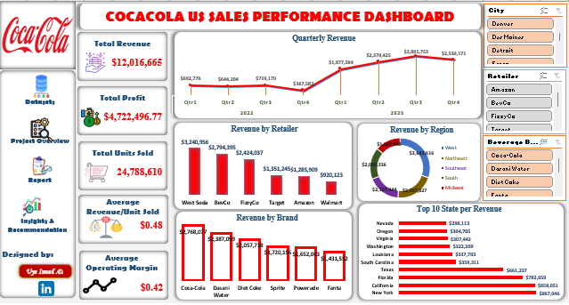

#  Coca-Cola U.S. Sales Performance Analysis/Record  

## 📌 Project Review  
This project explores **Coca-Cola’s U.S. sales dataset**, containing ~9,600 records across multiple retailers, states, and regions. The analysis dives into **sales revenue, profit, product categories, pricing, and retailer performance**.  

The goal is to uncover **key business insights** and build an **interactive Excel dashboard** that helps stakeholders make data-driven decisions on **growth, profitability, and market expansion**.  

---

## ✅ Objectives  
- 📊 Track sales and profit trends across products, time, and geography  
- 🥇 Identify **top-performing** and 🚨 **underperforming** beverages  
- 🏬 Evaluate **retailer contribution** to overall sales  
- 💰 Analyze **profitability and margin distribution**  
- 🎯 Deliver **actionable recommendations** for business growth  

---

## 🛠️ Tools & Technologies  
- 💻 **Microsoft Excel** → Data cleaning, analysis & dashboard design  
- 📈 **Pivot Tables & Charts** → Interactive exploration  
- 📂 **Coca-Cola Sales Dataset (.xls)** → Source data

---

## 🌐 Live Dashboard  
Experience the interactive dashboard live here:
[Click to view the live dashboard](https://1drv.ms/x/c/a145471cdb65b729/EUJwvMiMN4BHuoc1zodMpCkB9ITM1XKm_Wk0oRwsI230kw?e=vEYMgE)

---

## 🎯 Purpose  
To provide a **clear, data-driven overview** of Coca-Cola’s sales operations (2013–2015), highlighting **trends, revenue, profitability, and product performance** across regions and retailers.  

---

## 🔑 Key Insights from Dashboard  
- 💵 **Total Revenue:** $12,016,665  
   → Demonstrates Coca-Cola’s strong sales performance across regions.  
- 💰 **Total Profit:** $4,722,496.77  
   → Healthy profitability achieved, showing efficient cost management.  
- 📦 **Total Units Sold:** 24,788,610  
   → High sales volume indicates strong product demand and market reach.  
- ⚖️ **Average Revenue per Unit:** $0.48  
   → Despite a relatively low unit price, volume-driven sales ensure sustainability.  
- 📈 **Average Operating Margin:** $0.42  
   → Reflects strong operational efficiency and consistent profitability.  

---

## 🖼️ Dashboard Preview 

---

## ❓ Key Business Questions Answered  
- Which beverages generate the **highest and lowest revenue**?  
- Which **regions and states** drive the most sales?  
- Which **retailers** contribute most significantly?  
- How **profitable** are Coca-Cola’s different beverages?  
- What **sales patterns** emerge over time?  

---

## 🔑 Key Insights  
- 🥇 **Coca-Cola Classic** is the **top-selling product**, dominating both sales & revenue.  
- 🚨 **Powerade and Fanta** lag in performance, signaling growth opportunities.  
- 🏬 **Retailer dependence** is high – most sales come from a few big retailers.  
- 🌎 Sales are **geographically uneven**, with certain states leading while others show untapped potential.  
- 💰 **Profit margins** vary widely – some products generate high profit despite low sales.  

---

## 📊 Detailed Report  
From the dashboard analysis:  
- 🧾 **Total Units Sold** → Thousands across all retailers  
- 💵 **Total Revenue Generated** → Millions (USD)  
- 📈 **Operating Profit & Margin** → Strong for Coca-Cola Classic, weaker for niche products  
- 🌍 **Regional Sales Distribution** → High in populous states; growth opportunities in underrepresented areas  
- 🏬 **Retailer Analysis** → A handful of major retailers dominate, signaling both opportunities and risks  

---

## 💡 Recommendations  
- **Expand Product Strategy** → Boost underperforming lines (e.g., Powerade, Fanta) with promotions & campaigns  
- **Optimize Regional Presence** → Strengthen sales in weaker states via targeted marketing  
- **Diversify Retailer Base** → Reduce risk by partnering with smaller/regional retailers  
- **Improve Margins** → Reassess pricing & cost structures for low-profit products  

---

## 🚀 How to Use This Project  
1. 📂 **Clone/Download** this repository  
2. 💻 Open the **Excel Dashboard file** in Microsoft Excel (2016 or later recommended)  
3. 🔍 Explore **slicers & filters** for region, retailer, and product categories  
4. 📊 Analyze **trends, patterns & insights**  
5. 📝 Apply findings to guide **business strategy & decision-making**  

---

## 🏁 Conclusion  
The **Coca-Cola U.S. Sales Dashboard** provides a **360° view** of performance, profitability, and market coverage.  

By:  
- 📊 Addressing underperforming products  
- 🌍 Optimizing regional expansion  
- 🏬 Diversifying retailer dependence  
- 💰 Enhancing profit margins  

Coca-Cola can **strengthen market share** and achieve **sustainable growth**.  

---

🔗 I encourage you to explore the dashboard, test different filters, and discover how data-driven decision-making can transform business strategies.  

---

## 👨‍💻 Author  
**Ismail** – *Data Analyst | Data Enthusiast*  

I’m passionate about turning raw datasets into meaningful insights 📊. With hands-on experience in **Excel**, **SQL**, and **Power BI**, I enjoy analyzing, visualizing, and storytelling with data to support smarter business decisions 🚀.  

---

🔗 **Let’s Connect**  
- 🌐 [LinkedIn](https://www.linkedin.com/in/uye-ismail-d)  
- 📧 uyedanzismuye@gmail.com  
- 📧 uyeismaildanzismuye@gmail.com  

🔥 *“Without data, you’re just another person with an opinion.”* — W. Edwards Deming

---

## 🙏 Closing Note  
Thank you for taking the time to explore this project 💡.  
I hope the insights and recommendations spark new ideas and inspire smarter decisions.  

Feel free to ⭐ this repo if you found it useful, and don’t hesitate to explore my other projects for more data stories 📊✨.  

I’m always open to collaboration, feedback, and knowledge-sharing; let’s connect and build something impactful together! 🤝  
